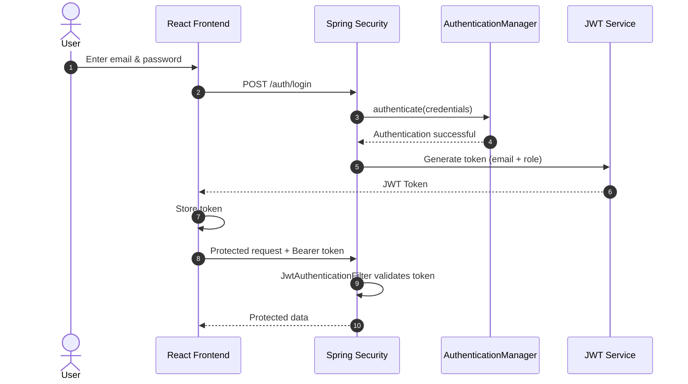

## 🔐 Authentication Flow

  

  
  
  

### How it works

| Step | What happens | Where |
|:---:|---|---|
| **1** | User enters email and password | React `Login` page |
| **2** | Credentials are sent to `POST /auth/login` | `authService` |
| **3** | Request passes through the Spring Security filter chain | Spring Security |
| **4** | `AuthenticationManager` verifies the credentials | Backend |
| **5** | User is authenticated | `CustomUserDetailsService` |
| **6** | A signed JWT (containing the role) is generated | Backend |
| **7** | Frontend receives and stores the token | `useAuth` context |
| **8** | Token is sent as `Authorization: Bearer <token>` on protected requests | `JwtAuthenticationFilter` validates it |

### Sequence diagram

### Role-based redirect

| Role | Redirect after login |
|---|---|
| `ADMIN` | `/admin/dashboard` |
| `USER` | `/dashboard` |
