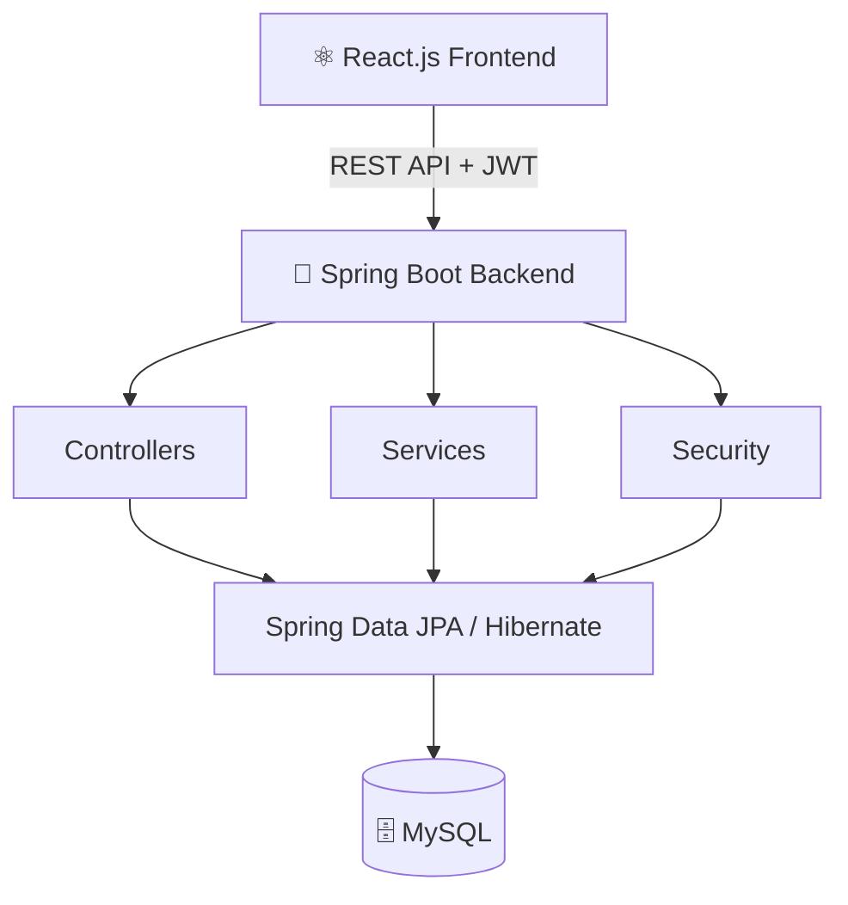
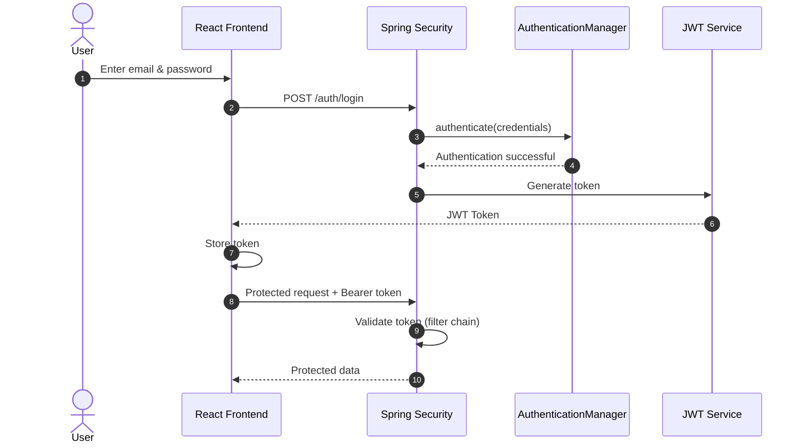
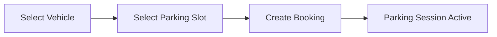
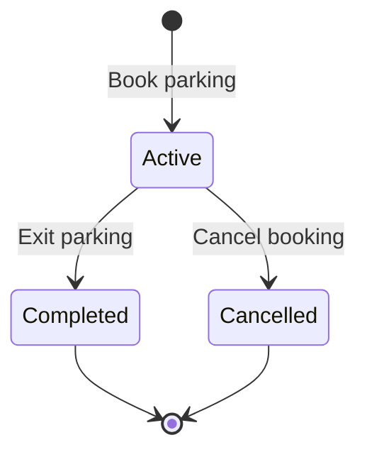
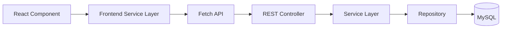
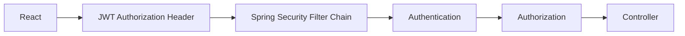
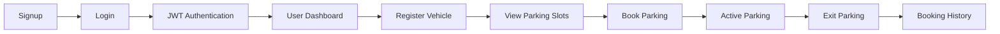
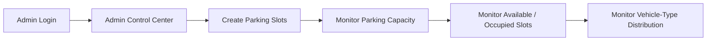

<div align="center">

<h1>🚗 Smart Parking System</h1>

<p><b>Park Smarter. Live Better.</b></p>

<p>
A modern full-stack parking management platform built with <b>Spring Boot</b>, <b>React</b>, <b>MySQL</b> and <b>JWT authentication</b>.
</p>

<p>
  
  
  
  
  
  
  
</p>

<p>
  <a href="#-overview">Overview</a> •
  <a href="#%EF%B8%8F-system-architecture">Architecture</a> •
  <a href="#-authentication--authorization">Security</a> •
  <a href="#-api-endpoints">API</a> •
  <a href="#%EF%B8%8F-getting-started">Getting Started</a>
</p>

</div>

---

## 📑 Table of Contents

- [Overview](#-overview)
- [Objectives](#-objectives)
- [Tech Stack](#%EF%B8%8F-tech-stack)
- [System Architecture](#%EF%B8%8F-system-architecture)
- [Authentication & Authorization](#-authentication--authorization)
- [Features](#-features)
- [Admin Control Center](#-admin-control-center)
- [API Architecture](#-api-architecture)
- [API Endpoints](#-api-endpoints)
- [Parking Pricing](#-parking-pricing)
- [Project Structure](#-project-structure)
- [Getting Started](#%EF%B8%8F-getting-started)
- [Application Flow](#-application-flow)
- [Security](#%EF%B8%8F-security)
- [Screenshots](#-screenshots)
- [Key Learnings](#-key-learnings)
- [Future Enhancements](#-future-enhancements)
- [Author](#-author)

---

## ✨ Overview

The application helps users find available parking slots, manage vehicles, book parking spaces, complete parking sessions and track parking activity. An **Admin Control Center** allows administrators to manage parking capacity and monitor slot availability.

| 👤 For Users | 🛠️ For Admins |
|---|---|
| Manage vehicles | Create and manage parking slots |
| View available parking slots | Monitor total parking capacity |
| Book parking slots | Monitor available and occupied slots |
| Exit and complete parking sessions | View distribution by vehicle type |
| View booking history | Monitor current slot status |
| Cancel eligible bookings | Protected by role-based authorization |

---

## 🎯 Objectives

- ⏱️ Reduce the time required to find parking
- 🅿️ Provide up-to-date parking slot availability
- 📅 Simplify parking slot booking
- 🚘 Centralize vehicle and booking management
- 🔐 Provide secure authentication and authorization
- 📊 Give administrators better visibility into parking capacity
- 🚫 Prevent unauthorized access to protected operations

---

## 🛠️ Tech Stack

### Backend

| Technology | Purpose |
|---|---|
|  | Core programming language |
|  | Backend application framework |
|  | Authentication & authorization |
|  | Stateless authentication |
| Spring Data JPA | Database interaction |
| Hibernate | ORM |
| REST APIs | Frontend-backend communication |
| Bean Validation | Request validation |
|  | Relational database |
| BCrypt | Password encryption |

### Frontend

| Technology | Purpose |
|---|---|
|  | User interface |
| React Router | Client-side routing |
|  | Application logic |
|  | Structure |
|  | Styling |
| Fetch API | REST API communication |
|  | Frontend build tool |

---

## 🏗️ System Architecture



---

## 🔐 Authentication & Authorization

The application implements **JWT-based authentication** with **role-based authorization**.

### Authentication Flow

<p align="center">
  
</p>



### Roles

| Role | Capabilities |
|---|---|
| 👤 **USER** | Register and login, manage vehicles, view parking slots, book parking, exit parking, view booking history, cancel eligible bookings |
| 🛠️ **ADMIN** | Access the Admin Control Center, create parking slots, monitor total / available / occupied slots, view distribution by vehicle type, monitor current slot status |

---

## 🚘 Features

### 🔑 Authentication

- User registration
- Secure login
- JWT authentication
- BCrypt password encryption
- Role-based authorization

### 🚗 Vehicle Management

| Vehicle Type | Icon |
|---|:---:|
| Car | 🚗 |
| Bike | 🏍️ |
| Auto | 🛺 |

Vehicle information includes: **vehicle number**, **vehicle type**, **brand** and **color**.

### 🅿️ Parking Availability

Users can view the latest parking slot information. Each slot contains the **slot number**, **vehicle type** and **current status**.

### 📅 Parking Booking

Users can book parking using their registered vehicle information.



### 🚪 Parking Exit

Users can complete their active parking session. The system calculates the **parking duration**, **total hours**, **total amount** and **booking status**.

### 📋 Booking History

Users can view their parking activity with pagination, including booking ID, entry time, exit time, total hours, total amount and booking status.

### ❌ Booking Cancellation

Users can cancel eligible parking bookings before completing the parking session.



---

## 📊 Admin Control Center

The application provides a dedicated dashboard for administrators.

### Dashboard Metrics

| 📦 Total Parking Slots | 🟢 Available Slots | 🔴 Occupied Slots | 📈 Current Occupancy |
|:---:|:---:|:---:|:---:|

### Vehicle-Type Breakdown

| Type | Total Slots | Available | Occupied |
|---|:---:|:---:|:---:|
| 🚗 Cars | ✔ | ✔ | ✔ |
| 🏍️ Bikes | ✔ | ✔ | ✔ |
| 🛺 Autos | ✔ | ✔ | ✔ |

### Parking Slot Management

Administrators can create parking slots by specifying the **slot number** and **slot type**.

```json
{
  "slotNumber": "B01",
  "slotType": "BIKE"
}
```

---

## 🔄 API Architecture



For protected APIs:



---

## 📡 API Endpoints

<details open>
<summary><b>🔑 Authentication</b></summary>

| Method | Endpoint | Description |
|:---:|---|---|
| `POST` | `/auth/register` | Register a new user |
| `POST` | `/auth/login` | Login and receive JWT |

</details>

<details open>
<summary><b>🚗 Vehicle</b></summary>

| Method | Endpoint | Description |
|:---:|---|---|
| `POST` | `/vehicle/saveVehicle` | Save a vehicle |
| `GET` | `/vehicle/my-vehicles` | Get logged-in user's vehicles |

</details>

<details open>
<summary><b>🅿️ Parking Slot</b></summary>

| Method | Endpoint | Description |
|:---:|---|---|
| `POST` | `/parkingslot/register` | Create a parking slot (Admin) |
| `GET` | `/parkingslot` | Get all parking slots |

</details>

<details open>
<summary><b>📅 Booking</b></summary>

| Method | Endpoint | Description |
|:---:|---|---|
| `POST` | `/booking/book` | Book parking |
| `PUT` | `/booking/exit` | Exit parking |
| `GET` | `/booking/my-bookings` | Get booking history |
| `PUT` | `/booking/cancel` | Cancel a booking |

</details>

Protected requests use:

```
Authorization: Bearer <JWT_TOKEN>
```

---

## 💰 Parking Pricing

| Vehicle Type | Price |
|---|---:|
| 🏍️ Bike | **₹20** / hour |
| 🛺 Auto | **₹30** / hour |
| 🚗 Car | **₹50** / hour |

---

## 🧩 Project Structure

<table>
<tr>
<td valign="top">

**Backend**

```
src/
└── main/
    └── java/
        └── com.sahil.smart_parking_project/
            ├── controller/
            ├── service/
            ├── repository/
            ├── entity/
            ├── dto/
            ├── mapper/
            ├── security/
            └── utils/
```

</td>
<td valign="top">

**Frontend**

```
src/
├── assets/
├── components/
├── context/
├── hooks/
├── layouts/
├── pages/
├── routes/
├── services/
├── utils/
└── App.jsx
```

</td>
</tr>
</table>

---

## ▶️ Getting Started

### Prerequisites

- ☕ Java 21+
- 📦 Maven
- 🗄️ MySQL
- 🟢 Node.js and npm
- 💻 IntelliJ IDEA / Eclipse / STS

### 1️⃣ Clone Repository

```bash
git clone https://github.com/Sahil2u47/smart_parking_system.git
cd smart_parking_system
```

### 2️⃣ Backend Setup

Create the MySQL database:

```sql
CREATE DATABASE smart_parkingdb;
```

Configure your MySQL credentials in the backend `application.properties`, then run the Spring Boot application.

```
Backend  →  http://localhost:8182
```

### 3️⃣ Frontend Setup

```bash
cd smart-parking-frontend
npm install
npm run dev
```

```
Frontend  →  http://localhost:5173
```

### ⚙️ Environment Configuration

Create a `.env` file inside the frontend project:

```env
VITE_API_BASE_URL=http://localhost:8182
```

---

## 🧪 Application Flow

### 👤 User Flow



### 🛠️ Admin Flow



---

## 🛡️ Security

| Protection | Description |
|---|---|
| 🔐 Spring Security | Secures the REST API |
| 🎟️ JWT authentication | Stateless token-based authentication |
| 🔑 BCrypt | Password hashing |
| 👥 Role-based authorization | `USER` and `ADMIN` permissions |
| 🚧 Protected REST endpoints | Unauthorized requests are rejected |
| 🧭 Frontend route protection | Guarded routes in React Router |
| 📨 Authorization headers | `Authorization: Bearer <JWT_TOKEN>` |

---

## 📸 Screenshots

> Add your screenshots to `docs/screenshots/` and update the file names below.

| 🏠 Home Page | 🔑 Login Page |
|:---:|:---:|
|  |  |

| 📝 Signup Page | 📊 User Dashboard |
|:---:|:---:|
|  |  |

| 🅿️ Parking Availability | 🚗 Vehicle Management |
|:---:|:---:|
|  |  |

| 📅 Booking Page | 📋 Booking History |
|:---:|:---:|
|  |  |

| 🛠️ Admin Control Center |
|:---:|
|  |

---

## 📚 Key Learnings

- Designing RESTful APIs using Spring Boot
- Spring Security and JWT authentication
- Role-based authorization
- Spring Data JPA and Hibernate
- MySQL database integration
- DTO-based API design
- Request validation
- React component architecture
- React Router protected routes
- Frontend-backend API integration
- Authentication state management
- Parking and booking workflow design

---

## 🚀 Future Enhancements

- [ ] 💳 Online payment integration
- [ ] 📧 Email notifications
- [ ] 📱 Mobile application
- [ ] 📍 GPS-based parking discovery
- [ ] 🔔 Real-time booking notifications
- [ ] 📊 Advanced parking analytics
- [ ] ☁️ Cloud deployment
- [ ] 📈 Admin reporting and revenue analytics

---

## 👨‍💻 Author

<div align="center">

### **Sahid Anwar**

*Java Backend Developer | Spring Boot Developer*

Interested in building scalable backend systems, REST APIs, secure applications and real-world software solutions.

<p>
  <a href="https://github.com/Sahil2u47/"></a>
  <a href="https://linkedin.com/in/sahid-anwar-955898280/"></a>
  <a href="https://leetcode.com/u/Sahil2u47/"></a>
</p>

</div>

---

<div align="center">

### ⭐ Support

If you find this project useful or interesting, consider giving it a ⭐ on GitHub.

<sub>Built with ❤️ using Spring Boot and React</sub>

</div>
