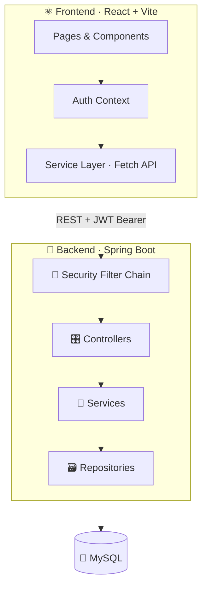
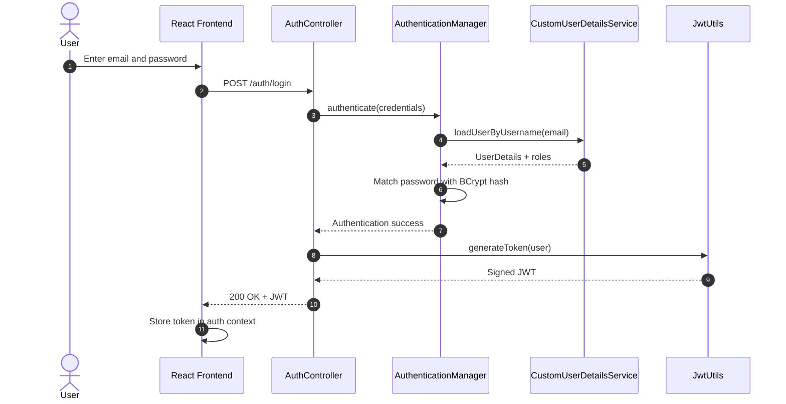
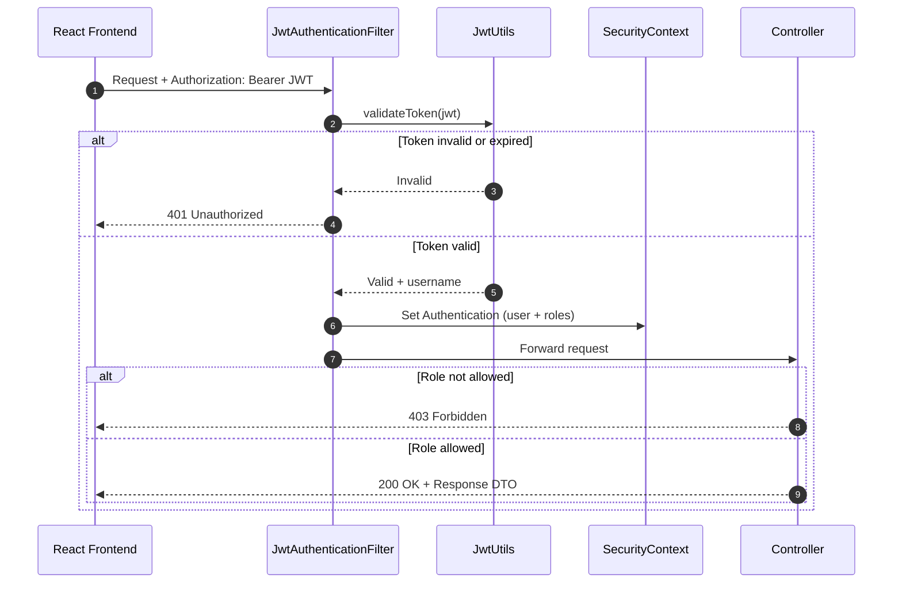
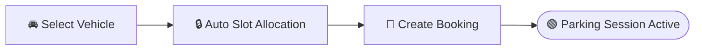
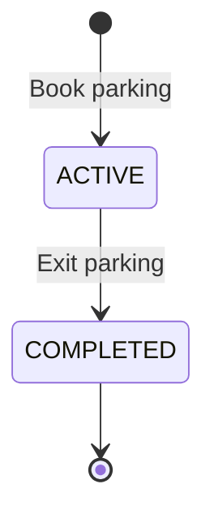
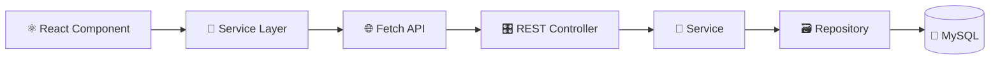
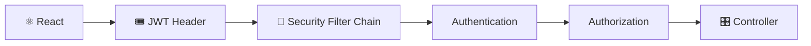
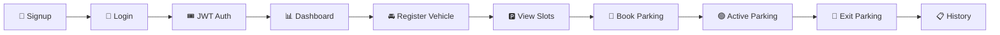
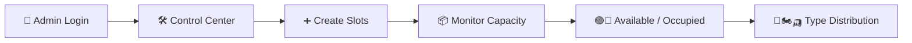

<div align="center">

<br/>

# 🚗 Smart Parking System

### Park Smarter. Live Better.

<p>
A modern <b>full-stack</b> parking management platform — <b>Spring Boot</b> · <b>React</b> · <b>MySQL</b> · <b>JWT</b><br/>
Automatic slot allocation, role-based dashboards, dynamic pricing and real-time capacity insights.
</p>

<p>
  
  
  
  
  
  
  
</p>

<p>
  
  
  
  
  
</p>

<p>
  <a href="#-overview"><b>Overview</b></a> &nbsp;•&nbsp;
  <a href="#-highlights"><b>Highlights</b></a> &nbsp;•&nbsp;
  <a href="#%EF%B8%8F-system-architecture"><b>Architecture</b></a> &nbsp;•&nbsp;
  <a href="#-authentication--authorization"><b>Security</b></a> &nbsp;•&nbsp;
  <a href="#-api-endpoints"><b>API</b></a> &nbsp;•&nbsp;
  <a href="#%EF%B8%8F-getting-started"><b>Get Started</b></a>
</p>

</div>

<br/>

---

<table align="center">
<tr>
<td align="center" width="20%"><h2>2</h2><sub>Roles<br/>USER · ADMIN</sub></td>
<td align="center" width="20%"><h2>3</h2><sub>Vehicle types<br/>CAR · BIKE · AUTO</sub></td>
<td align="center" width="20%"><h2>13</h2><sub>REST endpoints</sub></td>
<td align="center" width="20%"><h2>JWT</h2><sub>Stateless<br/>authentication</sub></td>
<td align="center" width="20%"><h2>0</h2><sub>Double-booked<br/>slots by design</sub></td>
</tr>
</table>

---

## 📑 Table of Contents

<details>
<summary><b>Click to expand</b></summary>

<br/>

1. [Overview](#-overview)
2. [Highlights](#-highlights)
3. [Objectives](#-objectives)
4. [Tech Stack](#%EF%B8%8F-tech-stack)
5. [System Architecture](#%EF%B8%8F-system-architecture)
6. [Authentication & Authorization](#-authentication--authorization)
7. [Features](#-features)
8. [Admin Control Center](#-admin-control-center)
9. [API Architecture](#-api-architecture)
10. [API Endpoints](#-api-endpoints)
11. [Parking Pricing](#-parking-pricing)
12. [Project Structure](#-project-structure)
13. [Getting Started](#%EF%B8%8F-getting-started)
14. [Application Flow](#-application-flow)
15. [Security](#%EF%B8%8F-security)
16. [Screenshots](#-screenshots)
17. [Key Learnings](#-key-learnings)
18. [Future Enhancements](#-future-enhancements)
19. [Author](#-author)

</details>

---

## ✨ Overview

> **Smart Parking System is more than a booking form.** It combines a secure Spring Boot backend with a React frontend so drivers can book parking in a few clicks while administrators keep full visibility of capacity and utilization.

<table>
<tr>
<td width="50%" valign="top">

### 👤 For Users
- 🚘 Manage vehicles
- 🅿️ View available parking slots
- 📅 Book parking in one step
- 🚪 Exit and complete parking sessions
- 📋 View booking history with pagination

</td>
<td width="50%" valign="top">

### 🛠️ For Admins
- ➕ Create and manage parking slots
- 📦 Monitor total parking capacity
- 🟢🔴 Track available and occupied slots
- 🚗🏍️🛺 View distribution by vehicle type
- 🛡️ Protected by role-based authorization

</td>
</tr>
</table>

---

## 🌟 Highlights

| | Capability | What makes it solid |
|:---:|---|---|
| 🔐 | **Secure by default** | Stateless JWT, BCrypt hashing, `USER` / `ADMIN` roles, guarded React routes |
| 🅿️ | **Automatic slot allocation** | Backend finds a free slot that matches the vehicle type — users never pick manually |
| ⚡ | **Concurrency safe** | `@Transactional` + `PESSIMISTIC_WRITE` locking so one slot is never assigned twice |
| 💰 | **Dynamic pricing** | Database-backed hourly rates with an occupancy-based surge multiplier locked at entry |
| 📊 | **Admin insights** | Live occupancy, vehicle-type breakdown and revenue analytics |
| 🧩 | **Clean API design** | DTOs + MapStruct, bean validation and centralized exception handling |
| ⚛️ | **Modern frontend** | React + Vite, React Router, context-based auth state and a service layer over Fetch API |

---

## 🎯 Objectives

- ⏱️ Reduce the time required to find parking
- 🅿️ Provide up-to-date parking slot availability
- 📅 Simplify parking slot booking
- 🚘 Centralize vehicle and booking management
- 🔐 Provide secure authentication and authorization
- 📊 Give administrators better visibility into parking capacity
- 🚫 Prevent unauthorized access to protected operations

---

## 🛠️ Tech Stack

<table>
<tr>
<td width="50%" valign="top">

### ⚙️ Backend

| Technology | Purpose |
|---|---|
|  | Core language |
|  | Application framework |
|  | AuthN & AuthZ |
|  | Stateless auth |
| Spring Data JPA · Hibernate | Persistence & ORM |
| MapStruct | DTO mapping |
| Bean Validation | Request validation |
|  | Relational database |
| BCrypt | Password hashing |

</td>
<td width="50%" valign="top">

### 🎨 Frontend

| Technology | Purpose |
|---|---|
|  | User interface |
| React Router | Routing & route guards |
|  | Application logic |
|  | Structure |
|  | Styling |
| Fetch API | REST communication |
|  | Build tool |

</td>
</tr>
</table>

---

## 🏗️ System Architecture



---

## 🔐 Authentication & Authorization

JWT-based **authentication** with **role-based authorization**, enforced on both the API and the React routes.

### Login & token generation



### Accessing a protected API



### Role matrix

| Capability | 👤 USER | 🛠️ ADMIN |
|---|:---:|:---:|
| Register & login | ✅ | ✅ |
| Manage own vehicles | ✅ | — |
| View parking slots | ✅ | ✅ |
| Book parking | ✅ | — |
| Exit parking | ✅ | — |
| View own booking history | ✅ | — |
| Create parking slots | — | ✅ |
| Update parking rates | — | ✅ |
| Admin Control Center & analytics | — | ✅ |

---

## 🚘 Features

### 🔑 Authentication

- User registration & secure login
- JWT authentication
- BCrypt password encryption
- Role-based authorization

### 🚗 Vehicle Management

| Vehicle Type | Icon |
|---|:---:|
| Car | 🚗 |
| Bike | 🏍️ |
| Auto | 🛺 |

Vehicle information includes **vehicle number**, **vehicle type**, **brand** and **color**.

### 🅿️ Parking Availability

Users can view the latest parking slot information. Each slot shows its **slot number**, **vehicle type** and **current status**.

### 📅 Parking Booking

Users pick a registered vehicle and book. The backend **automatically allocates** a matching free slot under a database lock.



### 🚪 Parking Exit

Users complete their active session. The system calculates **duration**, **total hours** (minimum one hour), **total amount** and updates the **booking status**.



### 📋 Booking History

Users can view their parking activity with pagination and sorting — booking ID, entry time, exit time, total hours, total amount and booking status.

---

## 📊 Admin Control Center

A dedicated dashboard for administrators.

### Dashboard metrics

<table align="center">
<tr>
<td align="center" width="25%"><h3>📦</h3><b>Total Slots</b><br/><sub>Overall capacity</sub></td>
<td align="center" width="25%"><h3>🟢</h3><b>Available</b><br/><sub>Ready to book</sub></td>
<td align="center" width="25%"><h3>🔴</h3><b>Occupied</b><br/><sub>Currently in use</sub></td>
<td align="center" width="25%"><h3>📈</h3><b>Occupancy</b><br/><sub>Current %</sub></td>
</tr>
</table>

### Vehicle-type breakdown

| Type | Total Slots | Available | Occupied |
|---|:---:|:---:|:---:|
| 🚗 Cars | ✔ | ✔ | ✔ |
| 🏍️ Bikes | ✔ | ✔ | ✔ |
| 🛺 Autos | ✔ | ✔ | ✔ |

### Parking slot management

Administrators create slots by specifying the **slot number** and **slot type**.

```json
{
  "slotNumber": "B01",
  "slotType": "BIKE"
}
```

---

## 🔄 API Architecture



Protected requests:



---

## 📡 API Endpoints

Protected requests must include:

```http
Authorization: Bearer <JWT_TOKEN>
```

<details open>
<summary><b>🔑 Authentication</b></summary>

<br/>

| Method | Endpoint | Description | Access |
|:---:|---|---|:---:|
|  | `/auth/register` | Register a new user | 🌍 Public |
|  | `/auth/login` | Login and receive JWT | 🌍 Public |

</details>

<details open>
<summary><b>🚗 Vehicle</b></summary>

<br/>

| Method | Endpoint | Description | Access |
|:---:|---|---|:---:|
|  | `/vehicle/saveVehicle` | Save a vehicle | 🔒 User |
|  | `/vehicle/my-vehicles` | Get logged-in user's vehicles | 🔒 User |

</details>

<details open>
<summary><b>🅿️ Parking Slot</b></summary>

<br/>

| Method | Endpoint | Description | Access |
|:---:|---|---|:---:|
|  | `/parkingslot/register` | Create a parking slot | 🛡️ Admin |
|  | `/parkingslot` | Get all parking slots | 🔑 Authenticated |

</details>

<details open>
<summary><b>📅 Booking</b></summary>

<br/>

| Method | Endpoint | Description | Access |
|:---:|---|---|:---:|
|  | `/booking/book` | Book parking | 🔒 User |
|  | `/booking/exit` | Exit parking | 🔒 User |
|  | `/booking/my-bookings` | Get paginated booking history | 🔒 User |

```http
GET /booking/my-bookings?page=0&size=10&sort=startTime,desc
```

</details>

<details open>
<summary><b>💰 Rates & 📊 Analytics</b></summary>

<br/>

| Method | Endpoint | Description | Access |
|:---:|---|---|:---:|
|  | `/parking-rates` | Get parking rates | 🔑 Authenticated |
|  | `/parking-rates/{vehicleType}` | Update a rate | 🛡️ Admin |
|  | `/admin/parking/analytics` | Parking occupancy analytics | 🛡️ Admin |
|  | `/admin/parking/booking-analytics` | Booking & revenue analytics | 🛡️ Admin |

</details>

<sub>🌍 Public &nbsp;·&nbsp; 🔑 Any authenticated user &nbsp;·&nbsp; 🔒 Role `USER` &nbsp;·&nbsp; 🛡️ Role `ADMIN`</sub>

---

## 💰 Parking Pricing

Rates are stored in the **database** and managed by admins — never hardcoded.

| Vehicle Type | Base Rate |
|---|---:|
| 🏍️ Bike | **₹20** / hour |
| 🛺 Auto | **₹30** / hour |
| 🚗 Car | **₹50** / hour |

> [!TIP]
> A **surge multiplier** is computed from current occupancy and **locked into the booking at entry**, so a driver is never charged more because the lot filled up after they arrived.

---

## 🧩 Project Structure

<table>
<tr>
<td valign="top" width="50%">

**⚙️ Backend**

```text
src/main/java/com.sahil.smart_parking_project/
├── controller/
├── service/
├── repository/
├── entity/
├── dto/
├── map_struct/
├── security/
├── globalException/
├── enums/
└── util/
```

</td>
<td valign="top" width="50%">

**🎨 Frontend**

```text
src/
├── assets/
├── components/
├── context/
├── hooks/
├── layouts/
├── pages/
├── routes/
├── services/
├── utils/
└── App.jsx
```

</td>
</tr>
</table>

---

## ▶️ Getting Started

### ✅ Prerequisites

| Requirement | Version |
|---|---|
| ☕ Java | 21+ |
| 📦 Maven | Wrapper included |
| 🐬 MySQL | 8.x |
| 🟢 Node.js & npm | Latest LTS |
| 💻 IDE | IntelliJ IDEA / Eclipse / STS |

### 1️⃣ Clone the repository

```bash
git clone https://github.com/Sahil2u47/smart_parking_system.git
cd smart_parking_system
```

### 2️⃣ Backend setup

Create the MySQL database:

```sql
CREATE DATABASE smart_parkingdb;
```

Set your environment variables, then run the Spring Boot application:

```env
DB_USERNAME=your_database_username
DB_PASSWORD=your_database_password
JWT_SECRET=your_long_secure_jwt_secret
```

```bash
./mvnw spring-boot:run        # Linux / macOS
mvnw.cmd spring-boot:run      # Windows
```

> 🟢 Backend → **http://localhost:8182**

### 3️⃣ Frontend setup

```bash
cd smart-parking-frontend
npm install
npm run dev
```

> 🟢 Frontend → **http://localhost:5173**

### ⚙️ Frontend environment

Create a `.env` file inside the frontend project:

```env
VITE_API_BASE_URL=http://localhost:8182
```

> [!WARNING]
> Never commit real credentials or your `JWT_SECRET`. Use a long, random secret in every environment.

---

## 🧪 Application Flow

### 👤 User journey



### 🛠️ Admin journey



---

## 🛡️ Security

| Protection | Description |
|---|---|
| 🔐 **Spring Security** | Secures the REST API |
| 🎟️ **JWT authentication** | Stateless token-based sessions |
| 🔑 **BCrypt** | Password hashing |
| 👥 **Role-based authorization** | `USER` and `ADMIN` permissions via `@PreAuthorize` |
| 🚧 **Protected endpoints** | Unauthorized requests are rejected (`401` / `403`) |
| 🧭 **Route protection** | Guarded routes in React Router |
| 📨 **Authorization header** | `Authorization: Bearer <JWT_TOKEN>` |
| ⚡ **Concurrency control** | `PESSIMISTIC_WRITE` locking on slot allocation |

---

## 📸 Screenshots

> Add your screenshots to `docs/screenshots/` and keep the file names below.

<table>
<tr>
<td align="center" width="50%"><b>🏠 Home</b><br/></td>
<td align="center" width="50%"><b>🔑 Login</b><br/></td>
</tr>
<tr>
<td align="center"><b>📝 Signup</b><br/></td>
<td align="center"><b>📊 User Dashboard</b><br/></td>
</tr>
<tr>
<td align="center"><b>🅿️ Parking Availability</b><br/></td>
<td align="center"><b>🚗 Vehicle Management</b><br/></td>
</tr>
<tr>
<td align="center"><b>📅 Booking</b><br/></td>
<td align="center"><b>📋 Booking History</b><br/></td>
</tr>
<tr>
<td align="center" colspan="2"><b>🛠️ Admin Control Center</b><br/></td>
</tr>
</table>

---

## 📚 Key Learnings

<table>
<tr>
<td width="50%" valign="top">

**⚙️ Backend**
- Designing RESTful APIs with Spring Boot
- Spring Security + JWT authentication
- Role-based authorization
- Spring Data JPA & Hibernate relationships
- Transactions and pessimistic locking
- DTO-based API design with MapStruct
- Request validation & global exception handling

</td>
<td width="50%" valign="top">

**🎨 Frontend**
- React component architecture
- React Router protected routes
- Frontend–backend API integration
- Authentication state management
- Service-layer pattern over Fetch API
- Parking & booking workflow design

</td>
</tr>
</table>

---

## 🚀 Future Enhancements

- [ ] 💳 Online payment integration
- [ ] 📧 Email / SMS notifications
- [ ] 🔔 Real-time booking notifications
- [ ] 📍 GPS-based parking discovery
- [ ] 📱 Mobile application

---

## 👨‍💻 Author

<div align="center">

### **Sahid Anwar**

*Java Backend Developer · Spring Boot Developer*

Building scalable backend systems, secure REST APIs and real-world software solutions.

<p>
  <a href="https://github.com/Sahil2u47/"></a>
  <a href="https://linkedin.com/in/sahid-anwar-955898280/"></a>
  <a href="https://leetcode.com/u/Sahil2u47/"></a>
</p>

</div>

---

<div align="center">

### 🚗 Smart Parking System — **Find. Book. Park.**

⭐ If you find this project useful or interesting, consider giving it a star on GitHub.

<sub>Built with ☕ Java, ⚛️ React and a lot of debugging.</sub>

</div>
