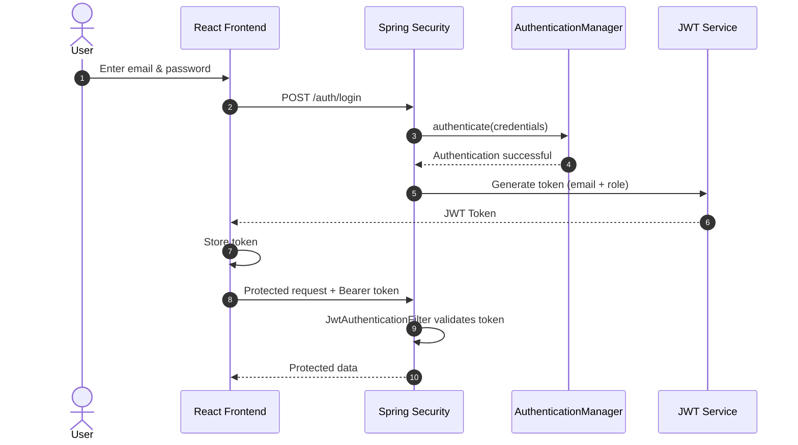

<h1 align="center">🅿️ Smart Parking System</h1>

<p align="center">
  <b>Park Smarter. Live Better.</b><br/>
  A full-stack parking management platform with JWT authentication, role-based access and automatic slot assignment.
</p>

<p align="center">
  
  
  
  
  
  
  
</p>

---

## 📑 Table of Contents

- [About the Project](#-about-the-project)
- [Features](#-features)
- [Tech Stack](#-tech-stack)
- [Authentication Flow](#-authentication-flow)
- [Screenshots](#-screenshots)
- [Project Structure](#-project-structure)
- [Getting Started](#-getting-started)
- [API Documentation](#-api-documentation)
- [Roadmap](#-roadmap)
- [Author](#-author)

---

## 📖 About the Project

**Smart Parking System** lets users register their vehicle and book parking without choosing a slot manually. The backend automatically assigns the **first available slot matching the vehicle type** (Car, Bike or Auto). Admins get a control center to manage parking capacity and monitor live occupancy.

The backend is built as a layered Spring Boot REST API secured with Spring Security and JWT. The frontend is a React (Vite) single-page app with a dark, glassmorphism-style UI.

---

## ✨ Features

### 👤 User
- Sign up and log in with email and password
- Book parking by entering vehicle number, type, brand and color
- Automatic slot assignment based on vehicle type
- Booking summary with the assigned slot
- Exit and billing, where partial hours are rounded up

### 🛡️ Admin
- Dedicated admin dashboard (`/admin/dashboard`)
- Live statistics: total, available and occupied slots, and occupancy %
- Slot breakdown by vehicle type (Car / Bike / Auto)
- Create and manage parking slots

### 🔒 Security
- Stateless JWT authentication
- Role-based access control (`ADMIN`, `USER`)
- Custom `JwtAuthenticationFilter` for protected routes
- Passwords stored hashed
- Global exception handling with clean error responses

---

## 🧰 Tech Stack

| Layer | Technologies |
|---|---|
| **Backend** | Java, Spring Boot 3, Spring MVC, Spring Security, JWT |
| **Persistence** | Spring Data JPA, Hibernate, MySQL 8 |
| **Mapping** | MapStruct |
| **API Docs** | SpringDoc OpenAPI (Swagger UI) |
| **Frontend** | React, React Router, Vite, plain CSS |
| **Tools** | Maven, Postman, Git, GitHub, STS / VS Code |

---

## 🔐 Authentication Flow

<p align="center">
  
</p>



| Role | Redirect after login |
|---|---|
| `ADMIN` | `/admin/dashboard` |
| `USER` | `/dashboard` |

---

## 📸 Screenshots

> Add your screenshots to `docs/screenshots/` and update the file names below.

| Login | Sign up |
|:---:|:---:|
|  |  |

| Booking | Admin Dashboard |
|:---:|:---:|
|  |  |

---

## 🗂️ Project Structure

```
Smart_Parking_Project/
├── smart-parking-project/        # Spring Boot backend
│   ├── src/main/java/...         # controller, service, repository, entity, dto, mapper, security, exception
│   ├── src/main/resources/
│   │   └── application.yml       # not committed (see Configuration)
│   └── pom.xml
│
├── smart-parking-frontend/       # React + Vite frontend
│   ├── src/
│   │   ├── assets/               # images (park3.jpg etc.)
│   │   ├── components/           # Button, Navbar, Footer ...
│   │   ├── hooks/                # useAuth
│   │   ├── pages/                # Login, Signup, Booking, Dashboard, AdminDashboard ...
│   │   ├── services/             # authService, bookingService, parkingService
│   │   └── utils/                # jwt helpers, constants
│   └── package.json
│
└── docs/                         # README assets
```

---

## 🚀 Getting Started

### Prerequisites

- Java 17 or higher
- Maven
- MySQL 8
- Node.js 18 or higher

### 1. Clone the repository

```bash
git clone https://github.com/Sahil2u47/smart_parking_system.git
cd smart_parking_system
```

### 2. Database

```sql
CREATE DATABASE smart_parkingdb;
```

### 3. Backend configuration

`application.yml` is not committed because it holds secrets. Create `src/main/resources/application.yml`:

```yaml
server:
  port: 8182

spring:
  datasource:
    url: jdbc:mysql://localhost:3306/smart_parkingdb
    username: your_mysql_username
    password: your_mysql_password
  jpa:
    hibernate:
      ddl-auto: update
    open-in-view: false

# Add your JWT secret and expiration using the property names your code reads
jwt:
  secret: your_long_random_secret
  expiration: 86400000
```

### 4. Run the backend

```bash
cd smart-parking-project
mvn spring-boot:run
```

On first start, the application seeds the required roles (`ADMIN`, `USER`) and parking rates. The API runs at `http://localhost:8182`.

### 5. Run the frontend

```bash
cd smart-parking-frontend
npm install
npm run dev
```

The app runs at `http://localhost:5173`.

> New sign-ups are registered with the `USER` role. To get an admin account, update the role of an existing user in the database or use the seeded admin if your seeder creates one.

---

## 📚 API Documentation

Swagger UI is available once the backend is running:

```
http://localhost:8182/swagger-ui.html
```

| Method | Endpoint | Description | Access |
|---|---|---|---|
| `POST` | `/auth/register` | Register a new user | Public |
| `POST` | `/auth/login` | Log in and receive a JWT | Public |

All other endpoints require the header:

```
Authorization: Bearer <your_jwt_token>
```

Use Swagger UI for the complete and up-to-date list of endpoints.

---

## 🗺️ Roadmap

- [ ] Continue-with-Google (OAuth2) login
- [ ] Forgot password flow
- [ ] Toast notifications instead of browser alerts
- [ ] Online payment integration
- [ ] Booking history for users
- [ ] Deployment (backend + frontend)

---

## 👨‍💻 Author

**Sahil**

[](https://github.com/Sahil2u47)

If you found this project useful, please consider giving it a ⭐

---

<p align="center">Made with ❤️ using Spring Boot and React</p>
